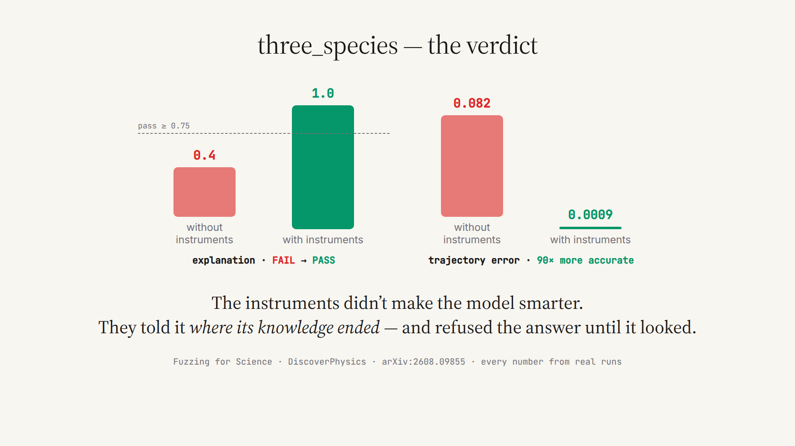

# Fuzzing for Science

**Instruments for autonomous discovery agents — the official demo code for
[*Agentic Auto-Research is Fuzz Testing*](https://arxiv.org/abs/2608.09855).**

Greybox fuzzers work because every execution returns a cheap, dense signal — coverage —
that steers the next input long before a crash is found. The paper argues autonomous
research agents need the same feedback architecture. This repository is that argument
made runnable: two oracle-free instruments and one rule with teeth, wired into a live
physics-discovery agent, plus the head-to-head run where they turned a failure into a
perfect-score discovery.

<p align="center"></p>

## The demo result

One world of [DiscoverPhysics](https://arxiv.org/abs/2605.26087): `three_species`,
where 30 background particles secretly form three species with couplings **+1 / +3 / −2**.
One agent: GPT-5.6-Sol, bare workspace, same budget, same noise. The only difference
between the two runs in [`data/three_species/`](data/three_species/) is the instruments.

| | without instruments | with instruments |
|---|---|---|
| explanation (judge) | 0.4 — **FAIL** | **1.0 — PASS** |
| trajectory error (norm.) | 0.082 | **0.0009** (90× better) |
| what it found | "a single shared field; every particle responds identically" | **all three species, strengths +1 / +3 / −2** |

The pivot is on the record. Reacting to the panel in round 4, the winning agent wrote:

> *"The NaN-contaminated cases make **the aggregate residual diagnostic** unusable, while
> the valid-case fit is **far above the noise scale**; I will therefore test whether the
> missing structure is **species-dependent source and response charge**, rather than collect
> more redundant trajectories."*

"The aggregate residual diagnostic" is the instrument panel, named by the agent itself.
Eleven rounds later it submitted the exact law and scored 1.0.

▶ **[media/demo.mp4](media/demo.mp4)** — a 68-second walkthrough: the world in motion,
both runs step by step, every number and quote from these archived runs.

## The instruments

Everything is computed from the agent's **own** experiments and candidates — the
simulator's hidden state never crosses the wall, and the judge never sees the gauges.

**1 — Surprise** (σ-calibrated self-consistency). Each round, the agent's newest candidate
law is scored against every observation it has collected:

```
<instrument_panel>
- SURPRISE: your latest candidate law vs all 240 data points collected so far:
  median residual = 0.87 sigma, max = 5003786 sigma. Reading guide: ~1 sigma means
  the theory explains your data down to the noise floor; >2 sigma is a systematic
  misfit — that is not noise.
```

**2 — Envelope** (exploration ledger). The span every experimental knob has actually
been varied over — a map of the agent's own actions, not of the world:

```
- ENVELOPE explored so far (24 cases): initial radius 2.0–8.0; initial speed: 79% zero;
  time horizon <= 10. This is NOT a limit — it is the region your experiments have
  covered. Your law is only tested INSIDE it; outside it, it is unconstrained.
```

**3 — Submission gate** (protected validation, in miniature). A final law that cannot
reproduce the agent's own observations bounces back once, with the exact offending
configuration — revise, run the discriminating experiment, or defend the anomaly in
writing:

```
<submission_gate>
Your <final_law> has NOT been accepted yet. Scored against ALL the data you collected
this run: median 0.88 sigma, max = 7093 sigma. Worst offender: experiment
{p1: 20, pos2: [40, 0]} at t=50. A law that cannot reproduce your own observations
is not yet a discovery.
```

## Repository layout

```
harness/
  instrument.py        the panel + the gate (the paper's loop, ~400 lines, zero oracle)
  bridge_client.py     routes DiscoverPhysics' agent loop through a coding-agent CLI
                       (Claude Code / Codex / ...) and injects the panel each round
  harnesses/           per-CLI adapters
  run_cc.py            entry point: official DiscoverPhysics loop + bridge patched in
  launch_sweep.sh      one-command launcher (tmux session per world)
example/
  replay_panel.py      replay the panel round-by-round from an archived run — no API keys
analysis/
  replay_signals.py    recompute surprise + held-out curves for any archived run
  breadth.py           per-knob exploration-envelope statistics
data/three_species/
  without_instruments/ the bare run   (episode.json, result.json, ledger, log)
  with_instruments/    the winning run (same files; the panel text it saw is
                       reproducible from episode.json via example/replay_panel.py)
media/                 demo video + stills
```

## Quickstart

**Replay the demo data (no keys, no setup):**

```bash
python example/replay_panel.py data/three_species/with_instruments
```

This prints the exact panel the agent received before every round, and the gate's
verdict on the submitted law. For the surprise line and the gate you additionally need
`numpy` and a checkout of [DiscoverPhysics](https://github.com/SampsonML/DiscoverPhysics)
(`export DISCOVERPHYSICS_ROOT=/path/to/DiscoverPhysics`); the envelope line runs on the
standard library alone.

**Run your own instrumented episode** (needs the DiscoverPhysics repo and a coding-agent
CLI such as `claude` or `codex` on PATH, with its API access configured):

```bash
export DISCOVERPHYSICS_ROOT=/path/to/DiscoverPhysics
BRIDGE_INSTRUMENT=1 BRIDGE_SUBMISSION_GATE=1 \
  bash harness/launch_sweep.sh \
    --harness codex --model gpt-5.6-sol --effort high \
    --tag my-instrumented --worlds "three_species" --template /path/to/blank-workspace
```

Drop the two `BRIDGE_*` variables and you have the control arm — that is the entire
experimental difference between the two runs in `data/`.

## How the agent is wired

The bare agent is deliberately boring: a coding-agent CLI in an empty workspace,
driven by DiscoverPhysics' official experiment protocol. `bridge_client.py` forwards
each round's messages to the CLI and does exactly two extra things when instrumented:

1. after the experiment results, it appends the `<instrument_panel>` computed by
   `instrument.py` from the conversation so far (plus one sentence requiring the agent
   to state what the readings imply — information that is never read is not feedback);
2. when the reply contains a `<final_law>`, it scores that law against every logged
   observation and bounces it once if the residuals say the law contradicts the
   agent's own data.

Guidance signals steer; the protected verdict (held-out trajectories + an LLM judge the
agent never meets) still decides. That separation is the paper's central claim, and the
demo is one existence proof of it.

## Citation

```bibtex
@article{he2026agentic,
  title   = {Agentic Auto-Research is Fuzz Testing},
  author  = {He, Yifeng and Wang, Jicheng and Zhao, Yinzhe and Liu, Jiachen and Chen, Hao},
  journal = {arXiv preprint arXiv:2608.09855},
  year    = {2026}
}
```

The benchmark: *DiscoverPhysics: Benchmarking LLMs for Out-of-the-Box Scientific
Thinking* (arXiv:2605.26087). Archived trajectories for the wider replay study are
public under the [AgentNativeResearchLab](https://huggingface.co/AgentNativeResearchLab)
Hugging Face org.

## License

MIT.
